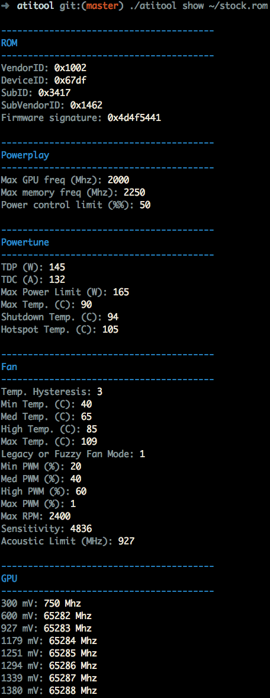

# atitool
Atitool is a tool for reading ATI Radeon RX 400 and 500 series Polaris VBIOS ROM files. 

It's inspired by PolarisBiosEditor. PBE is written in C# with Winforms GUI and has a terrible cross-platform experience. Atitool is designed to overcome those limitations. It outputs the following information.

* ROM data.
* Powerplay data.
* Powertune data.
* Fan data.
* GPU voltage data.
* Memory voltage data.
* GPU clock data.
* Memory clock data.

# Platforms
Tested
* macOS

Not tested
* Linux
* Windows


# TODO
* Allow modifying memory timings saved to a new ROM file.

# Compiling
```
go build
```

# Help
```
usage: atitool [<flags>] <command> [<args> ...]

A command-line tool for dealing with Radeon GPU bios files.

Flags:
  --help  Show context-sensitive help (also try --help-long and --help-man).

Commands:
  help [<command>...]
    Show help.

  show <file>
    Show values from the specified bios file.
    
```

# Example
